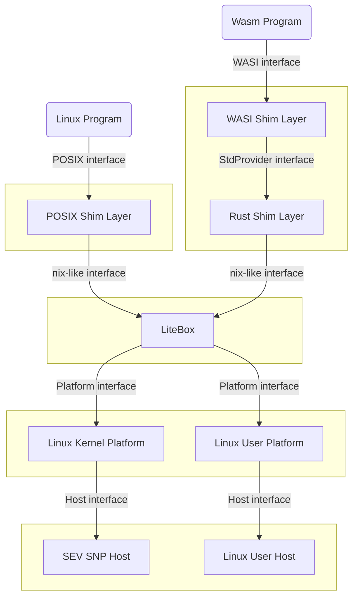

# LiteBox

> A security-focused library OS

LiteBox is a sandboxing library OS that drastically cuts down the interface to the host, thereby reducing attack surface. It is designed for usage in both kernel and non-kernel scenarios.

LiteBox exposes a [`nix`](https://docs.rs/nix)/[`rustix`](https://docs.rs/rustix)-like interface "above" when it is provided a `Platform` interface "below".

Example use cases include:
- VSBox, which provides a Linux ABI interface to run programs on top of SEV SNP
- WasmBox, which provides a WASI interface to run programs on unmodified Linux userland

The figure below shows roughly how LiteBox and related projects interact:

